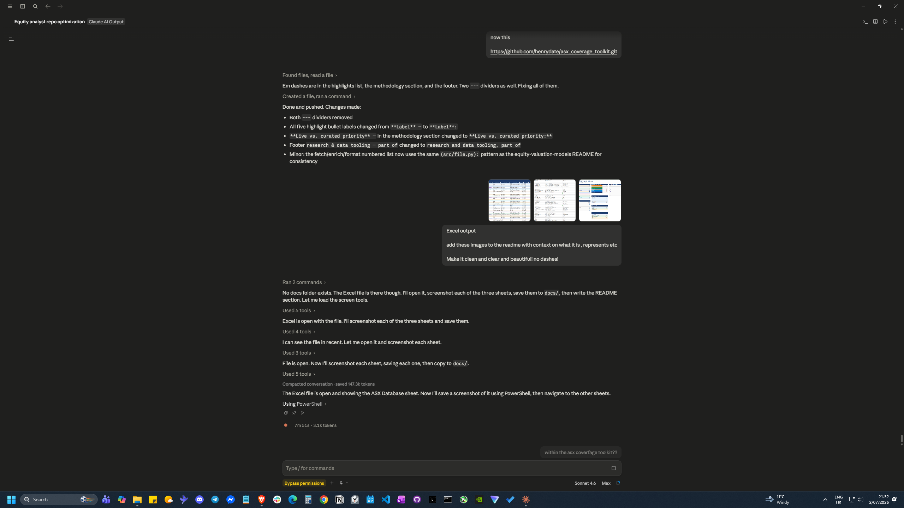
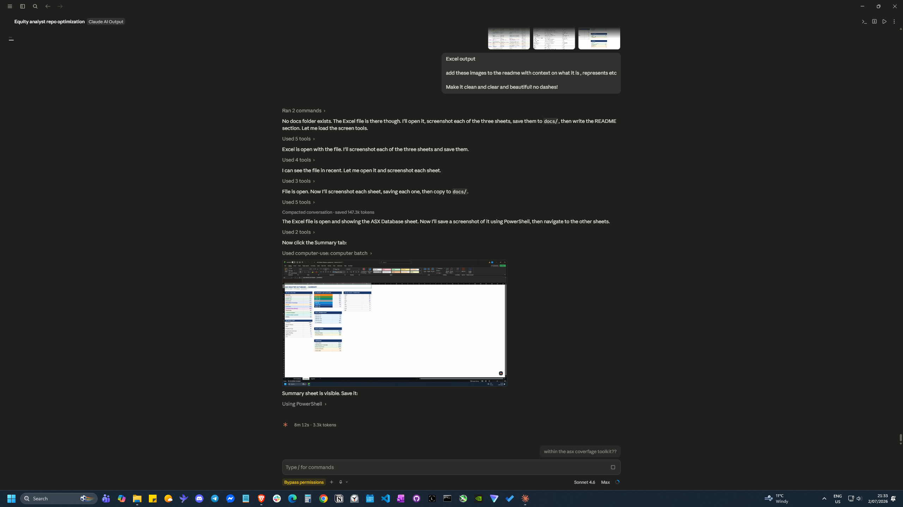
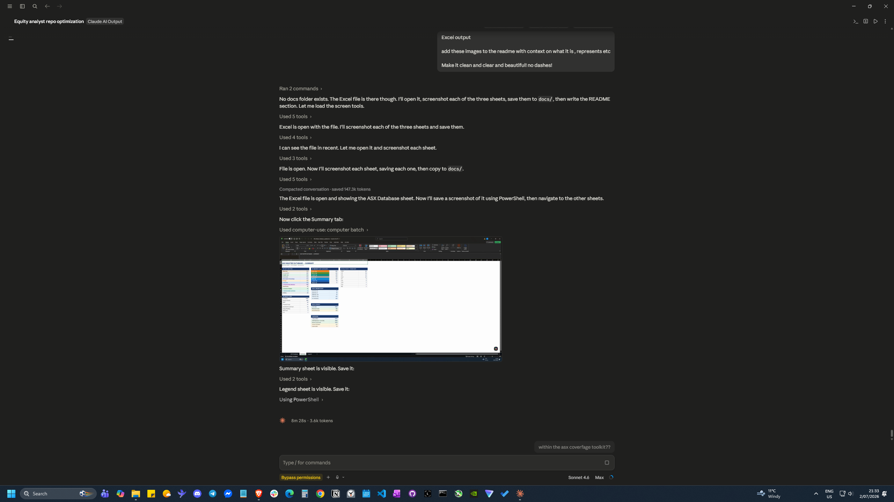

# ASX Coverage Toolkit

**A Python pipeline that scrapes, enriches, and packages the entire ASX-listed universe (~1,979 entities) into a single professionally formatted Excel research database, regenerated on demand from live market data.**

Built as a self-serve research-triage and screening tool for fundamental equity analysis. One command pulls live pricing and fundamentals from Yahoo Finance for every ASX ticker, layers in four-tier GICS sector classification, S&P/ASX index membership and curated research data, then renders the lot into a colour-coded, filterable workbook with a personal Buy / Hold / Sell and analysis-progress tracker.

> **Stack:** Python · pandas · yfinance · openpyxl · pytest · Jupyter

## Highlights

- **Automated data gathering:** `python run.py` fetches live market data for all ~1,979 ASX tickers via the Yahoo Finance API (`.AX` symbols), with batching, retry/back-off, a 24-hour JSON cache, and per-ticker fault tolerance (a missing or delisted ticker is logged and skipped, never crashing the run).
- **Three-tier data model:** research-verified fundamentals for major names, live yfinance data for the broader market, and transparent sector-median estimates for the long tail of micro/nano-caps. Every row is labelled with its source and confidence.
- **44-column enriched database:** identity, four-tier GICS, market data, fundamentals, company profile, corporate structure, index membership, and a personal research-workflow tracker.
- **Professional Excel output:** colour-coded by GICS sector, market-cap "chip" cells, dropdown-validated Buy/Hold/Sell and progress columns, auto-filter and frozen panes, plus a Summary dashboard and a Legend / data-quality sheet.
- **Jupyter showcase:** an end-to-end notebook walking through fetch, enrich, analyse, visualise and export.

## How it works

```
 data/ASX_Entities_Enriched.csv ─┐
                                 │
 Yahoo Finance  (yfinance) ──────┼──►  enrich()  ──►  1,979 × 44 DataFrame  ──►  build_workbook()  ──►  ASX_Master_Database.xlsx
                                 │
 src/company_data.py (curated) ──┘
```

1. **Fetch** (`src/fetch_live.py`): batch-pulls each ticker's `info` from yfinance, extracts roughly 30 fields (price, market cap, shares, P/E, P/B, beta, dividend yield, revenue, net income, 52-week range, analyst consensus, average volume, business summary), and caches the result to `data/yfinance_cache.json` with a per-ticker timestamp.
2. **Enrich** (`src/enrich.py`): merges three sources by priority (Research Data, then Live Data, then Sector Default) per field, so live data fills gaps for unresearched names but never overwrites curated fundamentals. It also derives entity type, domicile, market-cap category, GICS tiers, index flags and auto-generated data-quality notes.
3. **Format** (`src/format_excel.py`): builds the three-sheet workbook with openpyxl: the main **ASX Database**, a **Summary** dashboard, and a **Legend**.

## What it produces

`output/ASX_Master_Database.xlsx` with three sheets:

| Sheet | Description |
|---|---|
| **ASX Database** | 1,979 rows × 44 columns. Auto-filter on every column. Colour-coded by GICS sector. Dropdown BHS rating and progress tracker per row. |
| **Summary** | Live pivot counts by sector, entity type, market-cap category, index membership and data source. |
| **Legend** | Column definitions, data-quality key, disclaimer. |

### Columns

```
Identity:      Company · ASX Ticker · Entity Type · Market Cap Category
GICS (4-tier): Sector · Industry Group · Industry · Sub-Industry
Market data:   Market Cap · Share Price · Shares Outstanding · Data Date
Financials:    Revenue · Net Profit · Dividend Yield · Franking · P/E · P/B · Beta · ROE · D/E
Company info:  Currency · FY End · CEO · Website · Founded · Description · HQ State · Operations
Structure:     Domicile · Exchange · Dual Listed · Dual Exchange · Status
Indices:       ASX 20 · ASX 50 · ASX 100 · ASX 200 · All Ords · Index Membership (concatenated)
Workflow:      Data Source · BHS Rating (dropdown) · Progress (dropdown) · Notes
```

### Data sources and quality tiers

In the committed snapshot, **1,844 of 1,979 entities (93%) carry live or research-verified data.** Only the genuinely dataless tail (ETFs, structured products, suspended shells) falls back to estimates:

| Tier | Label | Snapshot | Confidence |
|---|---|---|---|
| 1 | `Research Data` | 155 | High: manually verified fundamentals for major names |
| 2 | `Live Data` | 1,689 | Medium: live yfinance market data |
| 3 | `Sector Estimate` | 135 | Low: sector-median defaults, screening use only |

The split refreshes on every run and is shown live on the workbook's **Summary** sheet and in the notebook.

## Workbook preview

### ASX Database



The main sheet: 1,979 rows, one per ASX-listed entity, across 44 columns. Rows are colour-coded by GICS sector (Materials in orange, Financials in teal, Health Care in green, Energy in yellow). Market capitalisation appears as a colour-coded chip cell (Mega Cap through to Nano Cap). The BHS Rating and Progress columns use Excel data-validation dropdowns so ratings stay consistent and filterable. Auto-filter is on every column header; panes are frozen so the company name and ticker stay in view while scrolling across the 44 columns.

### Summary



A live pivot dashboard that rebuilds every time the pipeline runs. It breaks the 1,979-entity universe down by GICS sector, market capitalisation category, head-office state or territory, entity type (Company, REIT, Special Vehicle, ETF, ABS Trust, etc.), index membership (S&P/ASX 20 / 50 / 100 / 200 and All Ordinaries), and data source tier. The Overview block at the bottom reports the key quality metrics: total entities, how many carry research or live data, and how many fall back to sector-median estimates.

### Legend



A column-by-column reference for every field in the database. Each of the 44 columns has a plain-English description and a worked example drawn from a real ASX entity. The Data Source Key at the top explains the three confidence tiers (Research Data, Live Data, Sector Estimate) and when to treat each one as reliable or indicative only.

## The Jupyter notebook

[`notebooks/asx_coverage_showcase.ipynb`](notebooks/asx_coverage_showcase.ipynb) runs the whole pipeline interactively and demonstrates the analysis layer:

- live fetch and cache walkthrough
- sector, market-cap and index breakdowns
- worked screening examples (e.g. ASX 200 materials with dividend yield > 4%)
- the richer live fields yfinance returns (52-week range, analyst consensus, liquidity)
- the Excel export step

## Quickstart

```bash
# Install dependencies
pip install -r requirements.txt

# Full pipeline: fetch live data, enrich, format, write the workbook
python run.py

# Build from the committed cache / curated data only (no network needed)
python run.py --no-fetch

# Force-refresh all live data (bypass cache)
python run.py --refresh

# Refresh specific tickers only
python run.py --refresh --tickers CBA,BHP,ANZ

# Custom output path
python run.py --output my_database.xlsx

# Run the test suite
python -m pytest tests/
```

The repo ships with a committed `data/yfinance_cache.json` snapshot, so `python run.py --no-fetch` reproduces the workbook offline immediately after cloning.

## Project structure

```
asx-coverage-toolkit/
├── README.md
├── requirements.txt
├── run.py                          # pipeline entry point (fetch -> enrich -> format)
├── data/
│   ├── ASX_Entities_Enriched.csv   # source universe: 1,979 entities + GICS
│   └── yfinance_cache.json         # committed live-data snapshot (24h TTL)
├── src/
│   ├── company_data.py             # curated fundamentals for ~155 major companies
│   ├── index_sets.py               # S&P/ASX 20/50/100/200 + All Ords constituents
│   ├── fetch_live.py               # yfinance batch fetcher + cache
│   ├── enrich.py                   # merge + enrichment pipeline
│   └── format_excel.py             # openpyxl workbook builder
├── notebooks/
│   └── asx_coverage_showcase.ipynb # end-to-end walkthrough + analysis
├── output/
│   └── ASX_Master_Database.xlsx    # finished deliverable
└── tests/
    └── test_enrich.py              # pytest smoke tests
```

## Methodology notes

**GICS classification** uses the four-tier Global Industry Classification Standard (MSCI / S&P Dow Jones). Entities with `GICS industry group = "Not Applic"` (ETFs, ABS trusts, special vehicles) are tagged `Unclassified`; entities pending classification are tagged `Class Pending`.

**Index membership** is based on the S&P/ASX rebalance announcements (March 2026), held as constituent sets in `src/index_sets.py`.

**Entity-type detection** is heuristic, derived from company-name patterns and GICS group. REITs, ETFs, LICs, ABS trusts and warrants are identified separately from operating companies.

**Live vs. curated priority:** live yfinance data drives the current price, market cap and valuation multiples for every covered name, while the curated `Research Data` layer adds the company profile (description, leadership, history, franking) and hand-verified statement fundamentals for major names. Marquee names show both live pricing and a richer profile; the long tail runs entirely on live data.

## Disclaimer

Everything here is personal project work shared to demonstrate analytical and technical capability. It is general information only, not financial product advice, and I am not licensed to provide financial advice. `Sector Estimate` rows use illustrative sector-median defaults, not company-specific data. Always verify against ASX announcements, company disclosures or a licensed data provider before making any investment decision.

*Fundamental equity research and data tooling, part of [henrydate](https://github.com/henrydate).*
